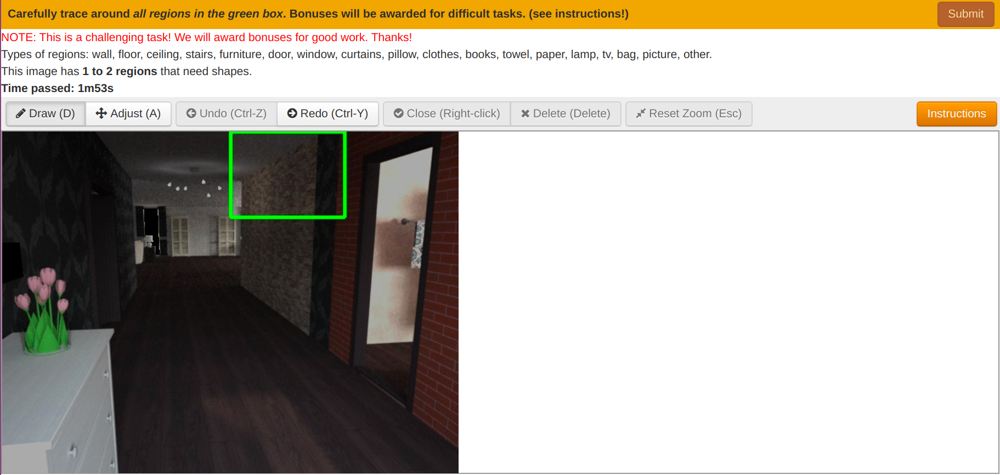
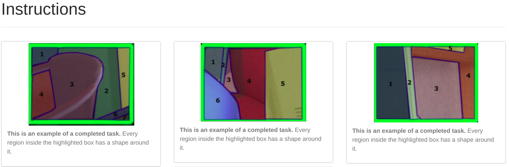
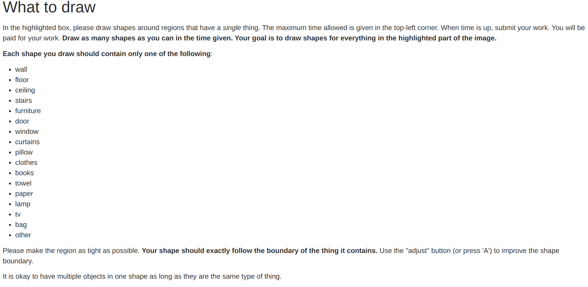

## Block Annotation ICCV 2019

### Creating Block Images
Create highlighted block images to annotate:
```
python create_highlighted_block_images.py
```

### Annotation Interface
Block images can be annotated with existing polygon annotation tools.

Labelme: https://github.com/wkentaro/labelme

OpenSurfaces: http://opensurfaces.cs.cornell.edu/

For our experiments, we build our crowdsourcing pipeline with OpenSurfaces:



Sample instructions for workers:



### Citation
If our work is useful to you, please consider citing:
```
@inproceedings{lin2019block,
  title={Block Annotation: Better Image Annotation with Sub-Image Decomposition},
  author={Lin, Hubert and Upchurch, Paul and Bala, Kavita},
  booktitle={2019 IEEE International Conference on Computer Vision (ICCV)},
  year={2019}
}
```

